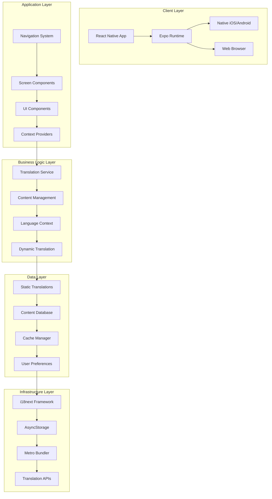
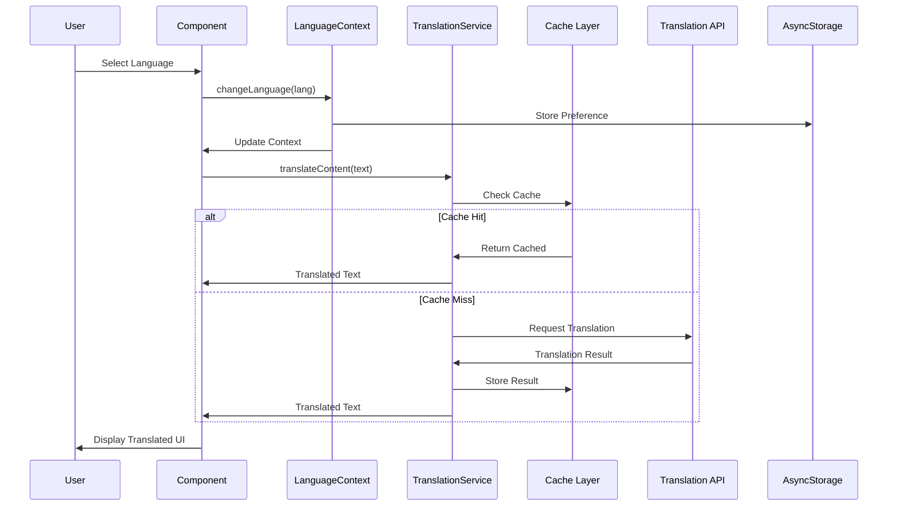
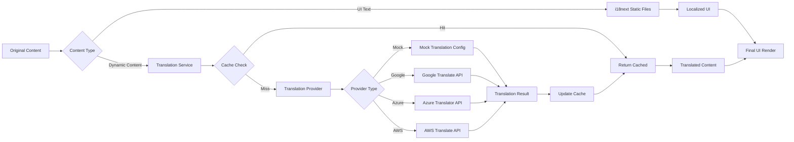
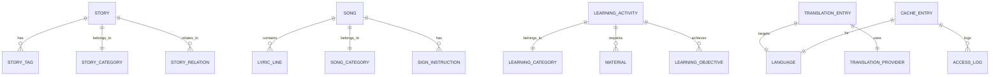
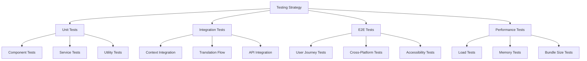
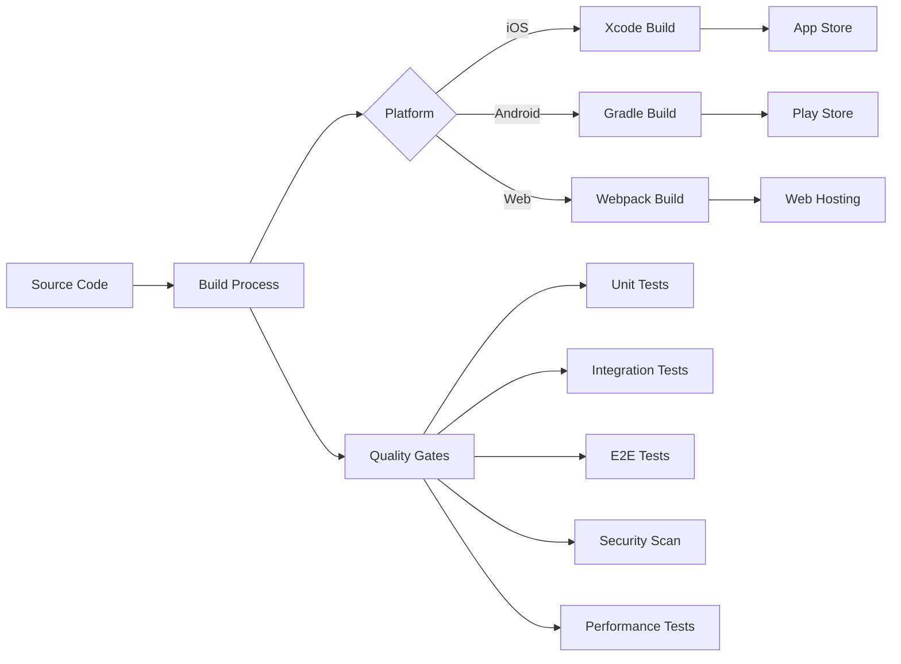

# CurioApp System Architecture Documentation

> **Technical architecture overview for CurioApp's comprehensive multilingual educational platform**

## 📋 Document Overview

This document provides a detailed technical architecture overview of CurioApp, focusing on system design, data flow, component architecture, and implementation patterns. It serves as a reference for developers, architects, and technical stakeholders.

**Version**: 1.4.0  
**Last Updated**: November 11, 2025  
**Audience**: Technical Team, Architects, DevOps Engineers  

---

## 🏗️ System Architecture Overview

### High-Level System Design



### Architecture Principles

1. **Separation of Concerns**: Clear separation between UI, business logic, and data layers
2. **Modularity**: Loosely coupled components with well-defined interfaces
3. **Scalability**: Designed to handle multiple languages and growing content
4. **Performance**: Optimized for mobile devices with caching and lazy loading
5. **Maintainability**: Clean code architecture with comprehensive documentation
6. **Testability**: Modular design enables thorough unit and integration testing

---

## 🧩 Component Architecture

### Core Components Hierarchy

```
App.js
├── LanguageProvider (Context)
├── NavigationContainer
│   ├── TabNavigator
│   │   ├── HomeScreen
│   │   │   ├── CurioHeader
│   │   │   ├── TodayHighlight
│   │   │   ├── QuickActions
│   │   │   └── FeaturedContent
│   │   ├── EngageScreen
│   │   │   ├── StoriesSection
│   │   │   │   ├── TranslatedSongsList
│   │   │   │   └── StoryCard (Dynamic Translation)
│   │   │   ├── SongsSection
│   │   │   │   └── SongCard (Dynamic Translation)
│   │   │   ├── LearningSection
│   │   │   │   └── TranslatedLearningCategories
│   │   │   └── RecommendationsSection
│   │   │       └── TranslatedRecommendations
│   │   ├── MonitorScreen
│   │   │   ├── EnvironmentStatus
│   │   │   ├── SafetyAlerts
│   │   │   ├── RecentAlerts (Translated)
│   │   │   └── SafetyProgress (Translated)
│   │   └── PersonalizeScreen
│   │       ├── LanguageSelector
│   │       ├── NotificationSettings
│   │       └── UserPreferences
└── TranslationService (Singleton)
```

### Component Design Patterns

#### 1. **Container/Presentational Pattern**
```javascript
// Container Component (Smart)
const EngageScreenContainer = () => {
  const { currentLanguage } = useLanguage()
  const { translateContent } = useDynamicTranslation()
  const [stories, setStories] = useState([])
  
  useEffect(() => {
    loadAndTranslateStories()
  }, [currentLanguage])
  
  const loadAndTranslateStories = async () => {
    const translatedStories = await Promise.all(
      STORIES.map(story => translateContent(story))
    )
    setStories(translatedStories)
  }
  
  return <EngageScreenPresentation stories={stories} />
}

// Presentational Component (Dumb)
const EngageScreenPresentation = ({ stories }) => {
  return (
    <ScrollView>
      {stories.map(story => <StoryCard key={story.id} story={story} />)}
    </ScrollView>
  )
}
```

#### 2. **Higher-Order Components (HOCs)**
```javascript
const withTranslation = (WrappedComponent) => {
  return (props) => {
    const { t } = useTranslation()
    const { translateContent } = useDynamicTranslation()
    
    return (
      <WrappedComponent 
        {...props} 
        t={t} 
        translateContent={translateContent}
      />
    )
  }
}

// Usage
const TranslatedStoryCard = withTranslation(StoryCard)
```

#### 3. **Custom Hooks Pattern**
```javascript
// Encapsulate translation logic
const useContentTranslation = (content, type = 'text') => {
  const { currentLanguage } = useLanguage()
  const [translatedContent, setTranslatedContent] = useState(content)
  const [isLoading, setIsLoading] = useState(false)
  
  useEffect(() => {
    if (currentLanguage === 'en') {
      setTranslatedContent(content)
      return
    }
    
    translateContent()
  }, [content, currentLanguage])
  
  const translateContent = async () => {
    setIsLoading(true)
    try {
      const service = new TranslationService()
      const translated = await service.translateText(content, currentLanguage)
      setTranslatedContent(translated)
    } catch (error) {
      console.warn('Translation failed:', error)
      setTranslatedContent(content) // Fallback
    } finally {
      setIsLoading(false)
    }
  }
  
  return { translatedContent, isLoading }
}
```

---

## 🔄 Data Flow Architecture

### State Management Flow



### Translation Data Pipeline



### Context Architecture

```javascript
// Global State Architecture
const AppContextProvider = ({ children }) => {
  return (
    <LanguageProvider>
      <TranslationProvider>
        <ContentProvider>
          <NavigationProvider>
            {children}
          </NavigationProvider>
        </ContentProvider>
      </TranslationProvider>
    </LanguageProvider>
  )
}

// Context Communication Pattern
const useAppContext = () => {
  const language = useContext(LanguageContext)
  const translation = useContext(TranslationContext)
  const content = useContext(ContentContext)
  
  return { language, translation, content }
}
```

---

## 🗄️ Data Architecture

### Database Schema Design

#### Content Data Models

```typescript
// Core Content Types
interface Story {
  id: number
  title: string
  category: StoryCategory
  rating: number
  duration: string
  ageGroup: AgeGroup
  language: LanguageCode
  tags: string[]
  summary: string
  content: string
  moral: string
  metadata: StoryMetadata
  relations: StoryRelations
}

interface Song {
  id: string
  title: string
  category: SongCategory
  difficulty: DifficultyLevel
  duration: string
  ageGroup: AgeGroup
  audioFile: AudioResource
  lyrics: LyricLine[]
  signLanguage: SignInstruction[]
  learningGoals: string[]
  extensions: ActivityExtension[]
}

interface LearningActivity {
  id: string
  title: string
  category: LearningCategory
  type: ActivityType
  difficulty: DifficultyLevel
  duration: string
  ageGroup: AgeGroup
  instructions: string[]
  materials: Material[]
  objectives: LearningObjective[]
  assessment: AssessmentCriteria[]
}

// Translation Models
interface TranslationEntry {
  id: string
  sourceText: string
  targetLanguage: LanguageCode
  translatedText: string
  confidence: number
  provider: TranslationProvider
  timestamp: Date
  context?: TranslationContext
}

interface CacheEntry {
  key: string
  value: any
  timestamp: Date
  ttl: number
  accessCount: number
  lastAccess: Date
  metadata: CacheMetadata
}
```

#### Data Relationships



### Storage Strategy

#### 1. **Static Asset Storage**
```javascript
// Asset organization
assets/
├── audio/
│   ├── songs/
│   │   ├── en/
│   │   ├── zh/
│   │   └── fr/
│   ├── stories/
│   └── effects/
├── images/
│   ├── stories/
│   ├── activities/
│   └── ui/
└── videos/
    ├── sign-language/
    └── tutorials/
```

#### 2. **Dynamic Data Storage**
```javascript
// AsyncStorage key structure
const STORAGE_KEYS = {
  USER_LANGUAGE: 'user_language',
  TRANSLATION_CACHE: 'translation_cache_',
  USER_PREFERENCES: 'user_preferences',
  CONTENT_FAVORITES: 'content_favorites',
  LEARNING_PROGRESS: 'learning_progress'
}

// Cache storage implementation
class PersistentStorage {
  async storeTranslation(key, translation, ttl) {
    const cacheKey = `${STORAGE_KEYS.TRANSLATION_CACHE}${key}`
    const entry = {
      translation,
      timestamp: Date.now(),
      ttl
    }
    await AsyncStorage.setItem(cacheKey, JSON.stringify(entry))
  }
  
  async getTranslation(key) {
    const cacheKey = `${STORAGE_KEYS.TRANSLATION_CACHE}${key}`
    const stored = await AsyncStorage.getItem(cacheKey)
    
    if (!stored) return null
    
    const entry = JSON.parse(stored)
    if (Date.now() - entry.timestamp > entry.ttl) {
      await AsyncStorage.removeItem(cacheKey)
      return null
    }
    
    return entry.translation
  }
}
```

---

## ⚡ Performance Architecture

### Optimization Strategies

#### 1. **Memory Management**
```javascript
class MemoryOptimizer {
  constructor() {
    this.componentCache = new WeakMap()
    this.imageCache = new Map()
    this.translationCache = new LRUCache(1000)
  }
  
  // Component memoization
  memoizeComponent(component, props) {
    const key = this.generatePropsHash(props)
    
    if (this.componentCache.has(key)) {
      return this.componentCache.get(key)
    }
    
    const memoized = React.memo(component)
    this.componentCache.set(key, memoized)
    return memoized
  }
  
  // Image lazy loading
  async loadImage(uri) {
    if (this.imageCache.has(uri)) {
      return this.imageCache.get(uri)
    }
    
    const image = await Image.prefetch(uri)
    this.imageCache.set(uri, image)
    return image
  }
  
  // Memory cleanup
  cleanup() {
    // Clear expired cache entries
    this.translationCache.prune()
    
    // Clear unused images
    this.imageCache.clear()
    
    // Force garbage collection (development only)
    if (__DEV__ && global.gc) {
      global.gc()
    }
  }
}
```

#### 2. **Bundle Optimization**
```javascript
// metro.config.js - Advanced configuration
const { getDefaultConfig } = require('expo/metro-config')

const config = getDefaultConfig(__dirname)

// Tree shaking for translations
config.transformer.minifierConfig = {
  mangle: {
    reserved: ['translation', 'i18n', 'locale']
  },
  compress: {
    drop_console: true, // Remove console logs in production
    pure_funcs: ['console.log', 'console.warn']
  }
}

// Asset optimization
config.resolver.platforms = ['native', 'ios', 'android', 'web']
config.resolver.assetExts = ['png', 'jpg', 'jpeg', 'svg', 'gif', 'mp3', 'wav']

// Code splitting for large translation files
config.serializer.createModuleIdFactory = () => {
  return (path) => {
    // Generate stable module IDs for better caching
    return require('crypto')
      .createHash('sha256')
      .update(path)
      .digest('hex')
      .substring(0, 8)
  }
}

module.exports = config
```

#### 3. **Rendering Optimization**
```javascript
// Virtual list implementation for large content
const VirtualizedContentList = ({ items, renderItem }) => {
  const [visibleItems, setVisibleItems] = useState([])
  const [scrollPosition, setScrollPosition] = useState(0)
  
  const ITEM_HEIGHT = 100
  const CONTAINER_HEIGHT = Dimensions.get('window').height
  const VISIBLE_COUNT = Math.ceil(CONTAINER_HEIGHT / ITEM_HEIGHT) + 2
  
  useEffect(() => {
    const startIndex = Math.floor(scrollPosition / ITEM_HEIGHT)
    const endIndex = Math.min(startIndex + VISIBLE_COUNT, items.length)
    
    setVisibleItems(items.slice(startIndex, endIndex))
  }, [scrollPosition, items])
  
  const onScroll = useCallback((event) => {
    setScrollPosition(event.nativeEvent.contentOffset.y)
  }, [])
  
  return (
    <FlatList
      data={visibleItems}
      renderItem={renderItem}
      onScroll={onScroll}
      scrollEventThrottle={16}
      removeClippedSubviews={true}
      maxToRenderPerBatch={10}
      windowSize={5}
      initialNumToRender={10}
      getItemLayout={(data, index) => ({
        length: ITEM_HEIGHT,
        offset: ITEM_HEIGHT * index,
        index
      })}
    />
  )
}
```

### Performance Monitoring

```javascript
class PerformanceMonitor {
  constructor() {
    this.metrics = {
      renderTimes: [],
      translationTimes: [],
      cacheHitRates: [],
      memoryUsage: []
    }
  }
  
  startRenderTimer(componentName) {
    const startTime = performance.now()
    
    return () => {
      const endTime = performance.now()
      const renderTime = endTime - startTime
      
      this.metrics.renderTimes.push({
        component: componentName,
        time: renderTime,
        timestamp: Date.now()
      })
      
      // Alert if render time is too slow
      if (renderTime > 100) {
        console.warn(`Slow render detected: ${componentName} took ${renderTime}ms`)
      }
    }
  }
  
  trackTranslationPerformance(translationTime, fromCache) {
    this.metrics.translationTimes.push({
      time: translationTime,
      fromCache,
      timestamp: Date.now()
    })
  }
  
  generatePerformanceReport() {
    const avgRenderTime = this.calculateAverage(
      this.metrics.renderTimes.map(m => m.time)
    )
    
    const avgTranslationTime = this.calculateAverage(
      this.metrics.translationTimes.map(m => m.time)
    )
    
    const cacheHitRate = this.calculateCacheHitRate()
    
    return {
      avgRenderTime,
      avgTranslationTime,
      cacheHitRate,
      slowComponents: this.identifySlowComponents(),
      memoryTrend: this.analyzeMemoryTrend()
    }
  }
}
```

---

## 🔌 Integration Architecture

### External Services Integration

#### 1. **Translation API Integration**
```javascript
// Provider abstraction layer
class TranslationProviderManager {
  constructor() {
    this.providers = new Map()
    this.fallbackChain = ['google', 'azure', 'mock']
    this.circuitBreaker = new CircuitBreaker()
  }
  
  registerProvider(name, provider) {
    this.providers.set(name, provider)
  }
  
  async translate(text, targetLang, sourceLang = 'en') {
    for (const providerName of this.fallbackChain) {
      if (this.circuitBreaker.isOpen(providerName)) {
        continue // Skip failed provider
      }
      
      try {
        const provider = this.providers.get(providerName)
        const result = await provider.translate(text, targetLang, sourceLang)
        
        this.circuitBreaker.recordSuccess(providerName)
        return result
        
      } catch (error) {
        console.warn(`Provider ${providerName} failed:`, error)
        this.circuitBreaker.recordFailure(providerName)
        continue // Try next provider
      }
    }
    
    throw new Error('All translation providers failed')
  }
}

// Circuit breaker implementation
class CircuitBreaker {
  constructor(threshold = 5, timeout = 60000) {
    this.failures = new Map()
    this.threshold = threshold
    this.timeout = timeout
  }
  
  recordFailure(provider) {
    const current = this.failures.get(provider) || { count: 0, lastFailure: null }
    current.count++
    current.lastFailure = Date.now()
    this.failures.set(provider, current)
  }
  
  recordSuccess(provider) {
    this.failures.delete(provider)
  }
  
  isOpen(provider) {
    const failure = this.failures.get(provider)
    if (!failure) return false
    
    if (failure.count >= this.threshold) {
      const timeSinceLastFailure = Date.now() - failure.lastFailure
      return timeSinceLastFailure < this.timeout
    }
    
    return false
  }
}
```

#### 2. **Analytics Integration**
```javascript
class AnalyticsManager {
  constructor() {
    this.providers = []
    this.eventQueue = []
    this.flushInterval = 10000 // 10 seconds
    
    this.startFlushTimer()
  }
  
  addProvider(provider) {
    this.providers.push(provider)
  }
  
  track(event, properties = {}) {
    const eventData = {
      event,
      properties: {
        ...properties,
        timestamp: Date.now(),
        sessionId: this.getSessionId(),
        userId: this.getUserId(),
        language: this.getCurrentLanguage()
      }
    }
    
    this.eventQueue.push(eventData)
  }
  
  async flush() {
    if (this.eventQueue.length === 0) return
    
    const events = [...this.eventQueue]
    this.eventQueue = []
    
    await Promise.allSettled(
      this.providers.map(provider => provider.sendEvents(events))
    )
  }
  
  startFlushTimer() {
    setInterval(() => {
      this.flush()
    }, this.flushInterval)
  }
}

// Usage
const analytics = new AnalyticsManager()
analytics.track('translation_requested', {
  sourceLanguage: 'en',
  targetLanguage: 'zh',
  contentType: 'story',
  contentId: 'three-little-pigs'
})
```

### API Design Patterns

#### 1. **Repository Pattern**
```javascript
class ContentRepository {
  constructor(dataSource) {
    this.dataSource = dataSource
    this.cache = new Map()
  }
  
  async getStories(filters = {}) {
    const cacheKey = this.generateCacheKey('stories', filters)
    
    if (this.cache.has(cacheKey)) {
      return this.cache.get(cacheKey)
    }
    
    const stories = await this.dataSource.fetchStories(filters)
    this.cache.set(cacheKey, stories)
    return stories
  }
  
  async getStoryById(id) {
    const cacheKey = `story_${id}`
    
    if (this.cache.has(cacheKey)) {
      return this.cache.get(cacheKey)
    }
    
    const story = await this.dataSource.fetchStory(id)
    this.cache.set(cacheKey, story)
    return story
  }
  
  async updateStory(id, updates) {
    const story = await this.dataSource.updateStory(id, updates)
    
    // Invalidate related cache entries
    this.invalidateCache(['stories', `story_${id}`])
    
    return story
  }
}
```

#### 2. **Service Layer Pattern**
```javascript
class ContentService {
  constructor(repository, translationService) {
    this.repository = repository
    this.translationService = translationService
  }
  
  async getLocalizedStories(language, filters = {}) {
    // Get base stories
    const stories = await this.repository.getStories(filters)
    
    // If English, return as-is
    if (language === 'en') {
      return stories
    }
    
    // Translate stories
    const localizedStories = await Promise.all(
      stories.map(story => this.translationService.translateStory(story, language))
    )
    
    return localizedStories
  }
  
  async searchContent(query, language = 'en') {
    const results = await this.repository.search(query)
    
    if (language === 'en') {
      return results
    }
    
    // Translate search results
    return this.translationService.translateSearchResults(results, language)
  }
}
```

---

## 🧪 Testing Architecture

### Testing Strategy



#### 1. **Unit Testing Framework**
```javascript
// Test utilities
export const createMockTranslationService = () => ({
  translateText: jest.fn().mockResolvedValue('translated text'),
  translateStory: jest.fn().mockResolvedValue({
    title: 'translated title',
    content: 'translated content'
  }),
  cache: {
    get: jest.fn(),
    set: jest.fn(),
    getStats: jest.fn().mockReturnValue({
      hitRate: 0.9,
      size: 100
    })
  }
})

export const createMockLanguageContext = (language = 'en') => ({
  currentLanguage: language,
  changeLanguage: jest.fn(),
  supportedLanguages: ['en', 'zh', 'fr', 'es']
})

// Component testing
describe('TranslatedText Component', () => {
  let mockTranslationService
  
  beforeEach(() => {
    mockTranslationService = createMockTranslationService()
  })
  
  test('should display original text in English', () => {
    const { getByText } = render(
      <LanguageProvider value={createMockLanguageContext('en')}>
        <TranslatedText text="Hello World" />
      </LanguageProvider>
    )
    
    expect(getByText('Hello World')).toBeTruthy()
  })
  
  test('should translate text for non-English languages', async () => {
    const { getByText } = render(
      <LanguageProvider value={createMockLanguageContext('zh')}>
        <TranslatedText text="Hello World" />
      </LanguageProvider>
    )
    
    await waitFor(() => {
      expect(getByText('translated text')).toBeTruthy()
    })
    
    expect(mockTranslationService.translateText).toHaveBeenCalledWith(
      'Hello World', 
      'zh'
    )
  })
})
```

#### 2. **Integration Testing**
```javascript
// Translation service integration tests
describe('Translation Service Integration', () => {
  let service
  let mockCache
  let mockProvider
  
  beforeEach(() => {
    mockCache = new Map()
    mockProvider = {
      translate: jest.fn().mockResolvedValue('translated')
    }
    
    service = new TranslationService({
      cache: mockCache,
      provider: mockProvider
    })
  })
  
  test('should use cache for repeated translations', async () => {
    const text = 'Hello World'
    const targetLang = 'zh'
    
    // First call - should hit provider
    const result1 = await service.translateText(text, targetLang)
    expect(mockProvider.translate).toHaveBeenCalledTimes(1)
    
    // Second call - should use cache
    const result2 = await service.translateText(text, targetLang)
    expect(mockProvider.translate).toHaveBeenCalledTimes(1)
    expect(result1).toBe(result2)
  })
  
  test('should fallback on provider failure', async () => {
    mockProvider.translate.mockRejectedValue(new Error('API Error'))
    
    const result = await service.translateText('Hello', 'zh')
    expect(result).toBe('Hello') // Should return original text
  })
})
```

#### 3. **End-to-End Testing**
```javascript
// E2E test using Detox
describe('Language Switching E2E', () => {
  beforeAll(async () => {
    await device.launchApp()
  })
  
  test('should switch language and update UI', async () => {
    // Navigate to Personalize screen
    await element(by.text('Personalize')).tap()
    
    // Open language selector
    await element(by.id('language-selector')).tap()
    
    // Select Chinese
    await element(by.text('中文')).tap()
    
    // Verify UI updated
    await expect(element(by.text('个性化'))).toBeVisible()
    
    // Navigate to Engage screen
    await element(by.text('参与')).tap()
    
    // Verify stories are translated
    await expect(element(by.text('三只小猪'))).toBeVisible()
  })
})
```

---

## 🚀 Deployment Architecture

### Build Pipeline



### Environment Configuration

```javascript
// Environment-based configuration
const getConfig = () => {
  const environment = process.env.NODE_ENV || 'development'
  
  const baseConfig = {
    app: {
      name: 'CurioApp',
      version: '1.0.0'
    },
    translation: {
      cache: {
        enabled: true,
        maxSize: 1000,
        ttl: 86400000
      }
    }
  }
  
  const environmentConfigs = {
    development: {
      ...baseConfig,
      api: {
        baseURL: 'http://localhost:3000',
        timeout: 10000
      },
      translation: {
        ...baseConfig.translation,
        provider: 'mock',
        debug: true
      },
      logging: {
        level: 'debug',
        console: true
      }
    },
    
    staging: {
      ...baseConfig,
      api: {
        baseURL: 'https://staging-api.curioapp.com',
        timeout: 5000
      },
      translation: {
        ...baseConfig.translation,
        provider: 'google',
        apiKey: process.env.GOOGLE_TRANSLATE_API_KEY
      },
      logging: {
        level: 'info',
        console: false,
        remote: true
      }
    },
    
    production: {
      ...baseConfig,
      api: {
        baseURL: 'https://api.curioapp.com',
        timeout: 5000
      },
      translation: {
        ...baseConfig.translation,
        provider: 'azure',
        apiKey: process.env.AZURE_TRANSLATOR_KEY,
        cache: {
          enabled: true,
          maxSize: 2000,
          ttl: 86400000,
          persistToDisk: true
        }
      },
      logging: {
        level: 'warn',
        console: false,
        remote: true,
        analytics: true
      }
    }
  }
  
  return environmentConfigs[environment]
}
```

### Continuous Integration

```yaml
# .github/workflows/ci-cd.yml
name: CurioApp CI/CD

on:
  push:
    branches: [main, develop]
  pull_request:
    branches: [main]

jobs:
  test:
    runs-on: ubuntu-latest
    steps:
      - uses: actions/checkout@v2
      
      - name: Setup Node.js
        uses: actions/setup-node@v2
        with:
          node-version: '18'
          
      - name: Install dependencies
        run: npm ci
        
      - name: Run unit tests
        run: npm run test:unit
        
      - name: Run integration tests
        run: npm run test:integration
        
      - name: Test translation coverage
        run: npm run test:i18n
        
      - name: Bundle size analysis
        run: npm run analyze:bundle
        
  build:
    needs: test
    runs-on: ubuntu-latest
    strategy:
      matrix:
        platform: [ios, android, web]
    steps:
      - uses: actions/checkout@v2
      
      - name: Setup Expo CLI
        run: npm install -g @expo/cli
        
      - name: Build for ${{ matrix.platform }}
        run: expo build:${{ matrix.platform }}
        
      - name: Upload build artifacts
        uses: actions/upload-artifact@v2
        with:
          name: build-${{ matrix.platform }}
          path: build/
          
  deploy:
    needs: build
    runs-on: ubuntu-latest
    if: github.ref == 'refs/heads/main'
    steps:
      - name: Deploy to App Store
        if: matrix.platform == 'ios'
        run: expo upload:ios
        
      - name: Deploy to Play Store
        if: matrix.platform == 'android'
        run: expo upload:android
        
      - name: Deploy to Web
        if: matrix.platform == 'web'
        run: |
          npm run build:web
          aws s3 sync dist/ s3://${{ secrets.S3_BUCKET }}
```

---

## 📊 Monitoring & Observability

### Application Monitoring

```javascript
class ApplicationMonitor {
  constructor() {
    this.metrics = new MetricsCollector()
    this.logger = new Logger()
    this.alerting = new AlertingService()
  }
  
  // Performance monitoring
  trackPerformance(operation, duration, metadata = {}) {
    this.metrics.record('performance', {
      operation,
      duration,
      timestamp: Date.now(),
      ...metadata
    })
    
    // Alert on performance degradation
    if (duration > this.getPerformanceThreshold(operation)) {
      this.alerting.warn(`Slow operation detected: ${operation} took ${duration}ms`)
    }
  }
  
  // Error monitoring
  trackError(error, context = {}) {
    this.logger.error('Application error', {
      message: error.message,
      stack: error.stack,
      context,
      timestamp: Date.now(),
      userId: this.getUserId(),
      sessionId: this.getSessionId()
    })
    
    this.metrics.increment('errors', {
      type: error.constructor.name,
      ...context
    })
  }
  
  // User interaction monitoring
  trackUserInteraction(action, target, metadata = {}) {
    this.metrics.record('user_interaction', {
      action,
      target,
      timestamp: Date.now(),
      language: this.getCurrentLanguage(),
      ...metadata
    })
  }
  
  // Translation monitoring
  trackTranslation(sourceText, targetLang, provider, fromCache, duration) {
    this.metrics.record('translation', {
      sourceLength: sourceText.length,
      targetLanguage: targetLang,
      provider,
      fromCache,
      duration,
      timestamp: Date.now()
    })
    
    // Track translation quality metrics
    this.metrics.increment('translation_requests', {
      language: targetLang,
      provider,
      cached: fromCache
    })
  }
}
```

### Health Checks

```javascript
class HealthCheckService {
  constructor() {
    this.checks = new Map()
    this.registerDefaultChecks()
  }
  
  registerCheck(name, checkFunction) {
    this.checks.set(name, checkFunction)
  }
  
  async runHealthChecks() {
    const results = new Map()
    
    for (const [name, check] of this.checks) {
      try {
        const startTime = Date.now()
        const result = await Promise.race([
          check(),
          new Promise((_, reject) => 
            setTimeout(() => reject(new Error('Timeout')), 5000)
          )
        ])
        
        results.set(name, {
          status: 'healthy',
          responseTime: Date.now() - startTime,
          details: result
        })
        
      } catch (error) {
        results.set(name, {
          status: 'unhealthy',
          error: error.message,
          timestamp: Date.now()
        })
      }
    }
    
    return this.generateHealthReport(results)
  }
  
  registerDefaultChecks() {
    // Translation service health
    this.registerCheck('translation_service', async () => {
      const service = new TranslationService()
      const testTranslation = await service.translateText('test', 'zh')
      return { translation: testTranslation }
    })
    
    // Cache health
    this.registerCheck('cache_health', async () => {
      const cache = new TranslationCache()
      const stats = cache.getStats()
      return stats
    })
    
    // Storage health
    this.registerCheck('storage_health', async () => {
      await AsyncStorage.setItem('health_check', 'test')
      const value = await AsyncStorage.getItem('health_check')
      await AsyncStorage.removeItem('health_check')
      return { accessible: value === 'test' }
    })
  }
}
```

---

## 🔮 Future Architecture Considerations

### Scalability Improvements

#### 1. **Microservices Architecture**
```javascript
// Service mesh architecture for future scaling
class ServiceMesh {
  constructor() {
    this.services = new Map()
    this.gateway = new APIGateway()
  }
  
  registerService(name, service) {
    this.services.set(name, {
      instance: service,
      healthCheck: () => service.health(),
      loadBalancer: new LoadBalancer(),
      circuitBreaker: new CircuitBreaker()
    })
  }
  
  async callService(serviceName, method, ...args) {
    const service = this.services.get(serviceName)
    
    if (!service || service.circuitBreaker.isOpen()) {
      throw new Error(`Service ${serviceName} unavailable`)
    }
    
    try {
      const instance = service.loadBalancer.getInstance()
      const result = await instance[method](...args)
      
      service.circuitBreaker.recordSuccess()
      return result
      
    } catch (error) {
      service.circuitBreaker.recordFailure()
      throw error
    }
  }
}
```

#### 2. **Event-Driven Architecture**
```javascript
class EventBus {
  constructor() {
    this.subscribers = new Map()
    this.eventStore = []
  }
  
  subscribe(eventType, handler) {
    if (!this.subscribers.has(eventType)) {
      this.subscribers.set(eventType, [])
    }
    this.subscribers.get(eventType).push(handler)
  }
  
  async publish(eventType, data) {
    const event = {
      type: eventType,
      data,
      timestamp: Date.now(),
      id: generateEventId()
    }
    
    this.eventStore.push(event)
    
    const handlers = this.subscribers.get(eventType) || []
    await Promise.all(handlers.map(handler => handler(event)))
  }
}

// Usage for language changes
eventBus.subscribe('language_changed', async (event) => {
  const { language } = event.data
  
  // Update UI
  await updateUILanguage(language)
  
  // Clear translation cache
  await clearTranslationCache()
  
  // Preload common translations
  await preloadTranslations(language)
  
  // Track analytics
  analytics.track('language_changed', { language })
})
```

### Advanced Features Roadmap

1. **Real-time Collaborative Translation**
2. **AI-Powered Content Personalization**
3. **Offline-First Architecture with Sync**
4. **Progressive Web App (PWA) Support**
5. **Voice Recognition and Synthesis**
6. **Augmented Reality (AR) Integration**
7. **Machine Learning-Based Content Recommendations**

---

## 📚 References & Resources

### Technical Documentation
- [React Native Architecture Guide](https://reactnative.dev/docs/architecture-overview)
- [Expo Development Workflow](https://docs.expo.dev/workflow/overview/)
- [i18next Best Practices](https://www.i18next.com/overview/api)
- [Metro Bundler Configuration](https://facebook.github.io/metro/docs/configuration)

### API Documentation
- [Google Translate API](https://cloud.google.com/translate/docs)
- [Azure Translator API](https://docs.microsoft.com/en-us/azure/cognitive-services/translator/)
- [AWS Translate API](https://docs.aws.amazon.com/translate/)

### Performance Resources
- [React Native Performance](https://reactnative.dev/docs/performance)
- [Mobile App Performance Optimization](https://web.dev/mobile/)
- [Caching Strategies](https://aws.amazon.com/caching/)

---

*This architecture documentation serves as a comprehensive guide for understanding CurioApp's technical implementation. For specific implementation details, refer to the source code and additional documentation files.*

**Last Updated**: November 11, 2025  
**Version**: 1.4.0 - Stable Logging  
**Maintainers**: Technical Architecture Team