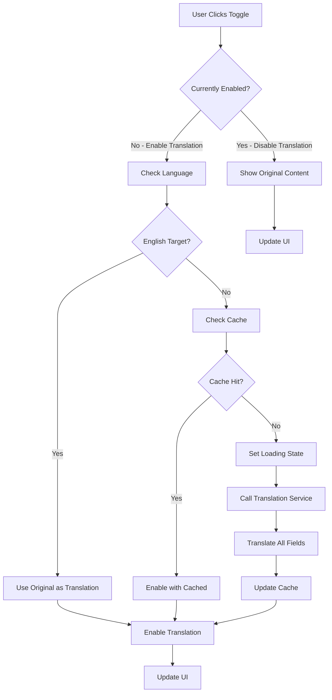

# Translation Toggle Implementation Guide

> **On-Demand Translation Toggle System for CurioApp Story Detail Screens**

## 📋 Overview

The Translation Toggle feature provides users with explicit control over content translation in story detail screens. This implementation prioritizes user experience, performance, and accessibility by offering on-demand translation instead of automatic background processing.

## 🎯 Goals & Requirements

### Primary Goals
- **User Control**: Let users decide when translation is needed
- **Performance**: Eliminate background translation overhead  
- **UX Excellence**: Smooth, responsive toggle experience
- **Accessibility**: Support screen readers and keyboard navigation

### Technical Requirements
- ✅ Toggle button with clear visual states
- ✅ Smart caching to avoid repeat API calls
- ✅ Error handling with user-friendly messages
- ✅ Integration with existing TTS system
- ✅ Responsive design for all screen sizes

## 🏗️ Architecture

### Component Structure

```
StoryDetailScreen
├── Translation Toggle Button
│   ├── Icon (language/hourglass)
│   ├── Text (Translate/Translating/Show Original)
│   └── Loading State Management
├── Language Indicator
│   └── Current translation language badge  
├── Content Display Logic
│   ├── Original Content Renderer
│   └── Translated Content Renderer
└── Cache Management
    ├── Translation Cache State
    └── Cache Key Generation
```

### State Management

```javascript
// Core toggle states
const [isTranslationEnabled, setIsTranslationEnabled] = useState(false);
const [isTranslating, setIsTranslating] = useState(false);
const [translationCache, setTranslationCache] = useState({});

// Derived states
const currentLanguage = i18n.language || 'en';
const cacheKey = `${data?.id}_${currentLanguage}`;
const buttonText = isTranslating 
  ? "Translating..." 
  : isTranslationEnabled 
    ? "Show Original" 
    : "Translate Story";
```

## 🔄 Implementation Flow

### 1. Toggle Activation Flow



### 2. Content Translation Process

```javascript
// Parallel translation of all content fields
const translateAllContent = async () => {
  const translations = {};
  
  // Translate all fields concurrently for better performance
  const translationPromises = [];
  
  if (data?.title) {
    translationPromises.push(
      translateService(data.title).then(result => {
        translations.title = result;
      })
    );
  }
  
  if (data?.content) {
    translationPromises.push(
      translateService(data.content).then(result => {
        translations.content = result;
      })
    );
  }
  
  if (data?.moral) {
    translationPromises.push(
      translateService(data.moral).then(result => {
        translations.moral = result;
      })
    );
  }
  
  // Wait for all translations to complete
  await Promise.all(translationPromises);
  
  return translations;
};
```

### 3. Cache Management

```javascript
// Cache key generation
const generateCacheKey = (storyId, languageCode) => `${storyId}_${languageCode}`;

// Cache structure with metadata
const cacheEntry = {
  translations: {
    title: "Translated title",
    content: "Translated content",
    moral: "Translated moral",
    // ... other fields
  },
  metadata: {
    timestamp: Date.now(),
    languageCode: currentLanguage,
    version: "1.0" // For cache invalidation if needed
  }
};

// Cache update with TTL consideration
const updateCache = (cacheKey, translations) => {
  setTranslationCache(prev => ({
    ...prev,
    [cacheKey]: {
      ...translations,
      timestamp: Date.now()
    }
  }));
};

// Cache validation (optional TTL check)
const isCacheValid = (cacheEntry) => {
  const maxAge = 24 * 60 * 60 * 1000; // 24 hours
  return (Date.now() - cacheEntry.timestamp) < maxAge;
};
```

## 🎨 UI/UX Design

### Button States

#### 1. Default State (Ready to Translate)
```javascript
<TouchableOpacity style={styles.translationToggleDefault}>
  <Icon name="language-outline" size={16} color="#007AFF" />
  <Text style={styles.defaultText}>Translate Story</Text>
</TouchableOpacity>
```

#### 2. Loading State (Translation in Progress)
```javascript
<TouchableOpacity style={styles.translationToggleLoading} disabled={true}>
  <Icon name="hourglass-outline" size={16} color="#007AFF" />
  <Text style={styles.loadingText}>Translating...</Text>
</TouchableOpacity>
```

#### 3. Active State (Translation Enabled)
```javascript
<TouchableOpacity style={styles.translationToggleActive}>
  <Icon name="language-outline" size={16} color="#FFFFFF" />
  <Text style={styles.activeText}>Show Original</Text>
</TouchableOpacity>
```

### Visual Design System

```javascript
const styles = StyleSheet.create({
  translationToggleContainer: {
    alignItems: 'center',
    marginBottom: 16,
    paddingHorizontal: 20,
  },
  
  // Default state - outlined button
  translationToggleDefault: {
    flexDirection: 'row',
    alignItems: 'center',
    backgroundColor: '#F8FAFF',
    borderColor: '#007AFF',
    borderWidth: 1.5,
    borderRadius: 22,
    paddingHorizontal: 18,
    paddingVertical: 10,
    minWidth: 150,
    justifyContent: 'center',
    shadowColor: '#007AFF',
    shadowOffset: { width: 0, height: 2 },
    shadowOpacity: 0.1,
    shadowRadius: 4,
    elevation: 3,
  },
  
  // Loading state - disabled with subtle animation
  translationToggleLoading: {
    flexDirection: 'row',
    alignItems: 'center',
    backgroundColor: '#F0F4F8',
    borderColor: '#B0BEC5',
    borderWidth: 1.5,
    borderRadius: 22,
    paddingHorizontal: 18,
    paddingVertical: 10,
    minWidth: 150,
    justifyContent: 'center',
    opacity: 0.8,
  },
  
  // Active state - filled button
  translationToggleActive: {
    flexDirection: 'row',
    alignItems: 'center',
    backgroundColor: '#007AFF',
    borderColor: '#007AFF',
    borderWidth: 1.5,
    borderRadius: 22,
    paddingHorizontal: 18,
    paddingVertical: 10,
    minWidth: 150,
    justifyContent: 'center',
    shadowColor: '#007AFF',
    shadowOffset: { width: 0, height: 4 },
    shadowOpacity: 0.3,
    shadowRadius: 6,
    elevation: 5,
  },
  
  toggleIcon: {
    marginRight: 8,
  },
  
  defaultText: {
    fontSize: 15,
    fontWeight: '600',
    color: '#007AFF',
    letterSpacing: 0.3,
  },
  
  loadingText: {
    fontSize: 15,
    fontWeight: '500',
    color: '#78909C',
    letterSpacing: 0.3,
  },
  
  activeText: {
    fontSize: 15,
    fontWeight: '600',
    color: '#FFFFFF',
    letterSpacing: 0.3,
  },
  
  // Language indicator badge
  languageIndicator: {
    marginTop: 8,
    paddingHorizontal: 12,
    paddingVertical: 4,
    backgroundColor: '#E8F5E8',
    borderRadius: 12,
    borderWidth: 1,
    borderColor: '#81C784',
  },
  
  languageText: {
    fontSize: 12,
    color: '#2E7D32',
    fontWeight: '600',
    textTransform: 'uppercase',
    letterSpacing: 0.5,
  },
});
```

## ⚡ Performance Optimizations

### 1. Parallel Translation Processing

```javascript
const translateContentInParallel = async (data) => {
  const fields = [
    { key: 'title', value: data?.title },
    { key: 'content', value: data?.content },
    { key: 'moral', value: data?.moral },
    { key: 'categoryName', value: data?.categoryName },
    { key: 'prevTitle', value: data?.previousStory?.title },
    { key: 'nextTitle', value: data?.nextStory?.title },
  ].filter(field => field.value); // Only translate non-empty fields
  
  const translationPromises = fields.map(async (field) => ({
    key: field.key,
    translation: await translateService(field.value)
  }));
  
  const results = await Promise.all(translationPromises);
  
  return results.reduce((acc, result) => {
    acc[result.key] = result.translation;
    return acc;
  }, {});
};
```

### 2. Debounced Toggle to Prevent Rapid Clicks

```javascript
import { debounce } from 'lodash';

const debouncedToggle = useMemo(
  () => debounce(handleTranslationToggle, 300),
  [handleTranslationToggle]
);

// Use debounced version in UI
<TouchableOpacity onPress={debouncedToggle}>
```

### 3. Memory-Efficient Caching

```javascript
const MAX_CACHE_ENTRIES = 50; // Limit cache size

const addToCache = (key, translations) => {
  setTranslationCache(prev => {
    const newCache = { ...prev, [key]: translations };
    
    // Remove oldest entries if cache is full
    const entries = Object.entries(newCache);
    if (entries.length > MAX_CACHE_ENTRIES) {
      const sortedEntries = entries.sort(
        (a, b) => (b[1].timestamp || 0) - (a[1].timestamp || 0)
      );
      const limitedEntries = sortedEntries.slice(0, MAX_CACHE_ENTRIES);
      return Object.fromEntries(limitedEntries);
    }
    
    return newCache;
  });
};
```

## 🔧 Integration Points

### 1. Text-to-Speech Integration

```javascript
// Dynamic content selection for TTS
const getContentForSpeech = () => {
  if (!isTranslationEnabled) {
    return data?.content || '';
  }
  
  const cacheKey = `${data?.id}_${currentLanguage}`;
  const cached = translationCache[cacheKey];
  return cached?.content || data?.content || '';
};

// Update TTS when translation toggles
useEffect(() => {
  const newContent = getContentForSpeech();
  if (newContent !== currentTTSContent) {
    // Stop current audio and update content
    if (isPlaying) {
      stopStory();
    }
    updateTTSContent(newContent);
  }
}, [isTranslationEnabled, translationCache]);
```

### 2. Navigation Integration

```javascript
// Preserve translation state when navigating
const navigateWithTranslationState = (route, params) => {
  navigation.navigate(route, {
    ...params,
    translationState: {
      isEnabled: isTranslationEnabled,
      cache: translationCache,
      language: currentLanguage
    }
  });
};

// Restore translation state on return
useEffect(() => {
  const savedState = route.params?.translationState;
  if (savedState) {
    setIsTranslationEnabled(savedState.isEnabled);
    setTranslationCache(savedState.cache);
  }
}, [route.params]);
```

### 3. Language Context Integration

```javascript
// Auto-invalidate cache when language changes
useEffect(() => {
  // Clear cache entries for different languages
  setTranslationCache(prev => {
    const filtered = {};
    Object.keys(prev).forEach(key => {
      if (key.endsWith(`_${currentLanguage}`)) {
        filtered[key] = prev[key];
      }
    });
    return filtered;
  });
}, [currentLanguage]);
```

## 🛡️ Error Handling & Edge Cases

### 1. Comprehensive Error Handling

```javascript
const handleTranslationToggle = async () => {
  if (!isTranslationEnabled) {
    setIsTranslating(true);
    
    try {
      // Validate prerequisites
      if (!data?.id) {
        throw new Error('Story data not available');
      }
      
      if (!currentLanguage) {
        throw new Error('Language not set');
      }
      
      // Attempt translation
      const translations = await translateAllContent(data);
      
      // Validate translation results
      if (!translations || Object.keys(translations).length === 0) {
        throw new Error('No translations received');
      }
      
      // Success - update state
      updateCache(cacheKey, translations);
      setIsTranslationEnabled(true);
      
    } catch (error) {
      // Detailed error logging for debugging
      console.error('Translation Toggle Error:', {
        error: error.message,
        stack: error.stack,
        storyId: data?.id,
        language: currentLanguage,
        timestamp: new Date().toISOString()
      });
      
      // User-friendly error handling
      const userMessage = getUserFriendlyErrorMessage(error);
      showErrorAlert(userMessage);
      
    } finally {
      setIsTranslating(false);
    }
  } else {
    // Disable translation
    setIsTranslationEnabled(false);
  }
};

const getUserFriendlyErrorMessage = (error) => {
  if (error.message.includes('network')) {
    return 'Network error. Please check your connection and try again.';
  } else if (error.message.includes('API')) {
    return 'Translation service temporarily unavailable. Please try again later.';
  } else {
    return 'Translation failed. Please try again.';
  }
};

const showErrorAlert = (message) => {
  Alert.alert(
    'Translation Error',
    message,
    [
      { text: 'OK', style: 'default' },
      { text: 'Retry', onPress: () => handleTranslationToggle() }
    ]
  );
};
```

### 2. Edge Case Handling

```javascript
// Handle missing or empty content
const safeTranslate = async (text) => {
  if (!text || typeof text !== 'string' || text.trim().length === 0) {
    return text; // Return original for empty/invalid content
  }
  
  try {
    const result = await translateService(text);
    return result && result.trim() ? result : text;
  } catch (error) {
    console.warn('Individual field translation failed:', error);
    return text; // Fallback to original
  }
};

// Handle partial translation failures
const translateWithPartialFallback = async (data) => {
  const translations = {};
  const fields = ['title', 'content', 'moral', 'categoryName'];
  
  for (const field of fields) {
    if (data[field]) {
      translations[field] = await safeTranslate(data[field]);
    }
  }
  
  return translations;
};
```

## 🧪 Testing Strategy

### Unit Tests

```javascript
describe('Translation Toggle', () => {
  let mockTranslateService;
  
  beforeEach(() => {
    mockTranslateService = jest.fn();
  });
  
  test('should enable translation and cache results', async () => {
    const storyData = {
      id: 'test-story',
      title: 'Test Story',
      content: 'Test content'
    };
    
    mockTranslateService
      .mockResolvedValueOnce('Translated Title')
      .mockResolvedValueOnce('Translated Content');
    
    const { result } = renderHook(() => useTranslationToggle(storyData));
    
    await act(async () => {
      await result.current.handleToggle();
    });
    
    expect(result.current.isTranslationEnabled).toBe(true);
    expect(result.current.translationCache).toHaveProperty('test-story_zh');
  });
  
  test('should handle translation errors gracefully', async () => {
    mockTranslateService.mockRejectedValue(new Error('API Error'));
    
    const { result } = renderHook(() => useTranslationToggle());
    
    await act(async () => {
      await result.current.handleToggle();
    });
    
    expect(result.current.isTranslationEnabled).toBe(false);
    expect(result.current.isTranslating).toBe(false);
  });
  
  test('should use cached translations on subsequent toggles', async () => {
    const { result } = renderHook(() => useTranslationToggle());
    
    // Set up cache
    act(() => {
      result.current.setCache({
        'test-story_zh': { title: 'Cached Title' }
      });
    });
    
    await act(async () => {
      await result.current.handleToggle();
    });
    
    // Should not call translate service for cached content
    expect(mockTranslateService).not.toHaveBeenCalled();
    expect(result.current.isTranslationEnabled).toBe(true);
  });
});
```

### Integration Tests

```javascript
describe('Translation Toggle Integration', () => {
  test('should integrate with TTS system', async () => {
    const { getByTestId } = render(
      <StoryDetailScreen route={{ params: { story: mockStory } }} />
    );
    
    const toggleButton = getByTestId('translation-toggle');
    const ttsButton = getByTestId('tts-button');
    
    // Toggle translation
    fireEvent.press(toggleButton);
    await waitFor(() => {
      expect(getByTestId('translated-content')).toBeTruthy();
    });
    
    // Test TTS with translated content
    fireEvent.press(ttsButton);
    // Verify TTS uses translated content
  });
  
  test('should preserve state during navigation', async () => {
    const navigation = createMockNavigation();
    const { getByTestId } = render(
      <StoryDetailScreen 
        navigation={navigation} 
        route={{ params: { story: mockStory } }} 
      />
    );
    
    // Enable translation
    fireEvent.press(getByTestId('translation-toggle'));
    await waitFor(() => {
      expect(getByTestId('translated-content')).toBeTruthy();
    });
    
    // Navigate away and back
    navigation.navigate('Home');
    navigation.goBack();
    
    // Verify translation state is preserved
    expect(getByTestId('translated-content')).toBeTruthy();
  });
});
```

### Manual Testing Checklist

#### Basic Functionality
- [ ] Toggle button displays correct initial state
- [ ] Clicking toggle starts translation process
- [ ] Loading state shows during translation
- [ ] Successful translation updates content and button state
- [ ] Clicking "Show Original" returns to original content
- [ ] Re-toggling uses cached translation (faster)

#### Error Scenarios
- [ ] Network disconnection during translation
- [ ] API rate limiting errors
- [ ] Invalid/empty story content
- [ ] Language service unavailable
- [ ] Partial translation failures

#### Performance Tests
- [ ] Large content translation (>1000 characters)
- [ ] Rapid toggle clicking (debouncing)
- [ ] Memory usage with large cache
- [ ] Battery impact during translation

#### Accessibility Tests
- [ ] Screen reader announces button states
- [ ] Keyboard navigation support
- [ ] High contrast mode compatibility
- [ ] Voice control integration

## 📱 Device Compatibility

### iOS Considerations
- Uses native iOS alert dialogs for error messages
- Haptic feedback on toggle interactions
- Dark mode support for button states
- Safe area handling for button positioning

### Android Considerations
- Material Design button ripple effects
- Android-specific error dialog styling
- Back button handling during translation
- Different screen density support

### Cross-Platform Optimizations
```javascript
import { Platform } from 'react-native';

const styles = StyleSheet.create({
  translationToggle: {
    ...Platform.select({
      ios: {
        shadowColor: '#007AFF',
        shadowOffset: { width: 0, height: 2 },
        shadowOpacity: 0.1,
        shadowRadius: 4,
      },
      android: {
        elevation: 3,
      },
    }),
  },
});

// Platform-specific error handling
const showPlatformAlert = (title, message) => {
  if (Platform.OS === 'ios') {
    Alert.alert(title, message, [
      { text: 'Cancel', style: 'cancel' },
      { text: 'Retry', style: 'default' }
    ]);
  } else {
    // Android-specific implementation
    ToastAndroid.show(`${title}: ${message}`, ToastAndroid.LONG);
  }
};
```

## 🚀 Future Enhancements

### Phase 2 Features
1. **Batch Translation**: Translate multiple stories in background
2. **Offline Translation**: Cache translations for offline use  
3. **Voice Translation**: Translate audio content
4. **Custom Languages**: User-defined translation preferences

### Phase 3 Features
1. **AI Context Translation**: Context-aware translation using AI
2. **Collaborative Translation**: Community-contributed translations
3. **Real-time Translation**: Live translation as content loads
4. **Translation Analytics**: Usage metrics and optimization insights

## 📊 Success Metrics

### Performance Metrics
- **Translation Speed**: Average time from button click to content display
- **Cache Hit Rate**: Percentage of translations served from cache
- **Error Rate**: Percentage of failed translation attempts
- **User Engagement**: Toggle usage frequency

### User Experience Metrics
- **User Satisfaction**: Feedback on translation quality and speed
- **Feature Adoption**: Percentage of users using translation toggle
- **Session Duration**: Impact of translation on content engagement
- **Accessibility Compliance**: Screen reader and keyboard navigation success

---

*This implementation guide provides comprehensive documentation for the Translation Toggle feature in CurioApp. For technical support or questions, refer to the main [Translation Guide](../TRANSLATION_GUIDE.md) or submit an issue in the repository.*