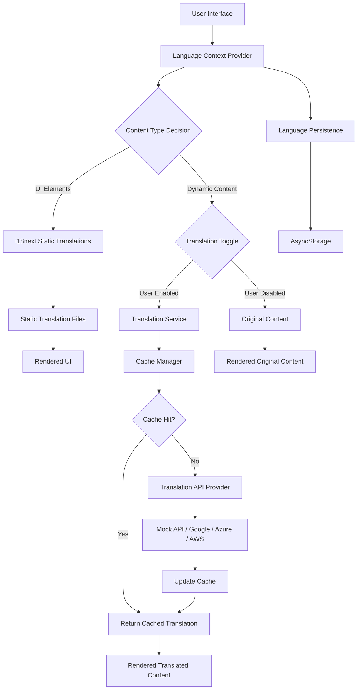
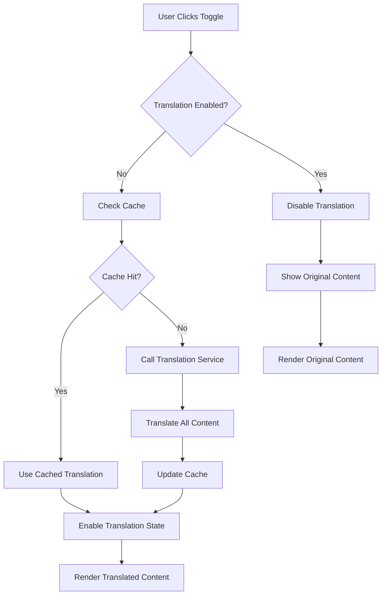

# CurioApp Translation System Guide

> **Comprehensive documentation for CurioApp's advanced internationalization and dynamic translation system**

## 📋 Table of Contents

1. [System Overview](#system-overview)
2. [Architecture Deep Dive](#architecture-deep-dive)
3. [Static Translation System](#static-translation-system)
4. [Dynamic Translation Service](#dynamic-translation-service)
5. [On-Demand Translation Toggle](#on-demand-translation-toggle)
6. [Implementation Details](#implementation-details)
7. [Performance Optimization](#performance-optimization)
8. [API Integration](#api-integration)
9. [Troubleshooting Guide](#troubleshooting-guide)
10. [Best Practices](#best-practices)
11. [Extending the System](#extending-the-system)

---

## 🌟 System Overview

CurioApp implements a **dual-layer translation architecture** that combines:

- **Static UI Internationalization**: Traditional i18next-based translation for UI elements
- **Dynamic Content Translation**: Real-time translation service for stories, songs, and activities

### Key Benefits

✅ **Flexibility**: Switch between static and dynamic translations based on content type  
✅ **Performance**: Intelligent caching reduces API calls and improves response times  
✅ **Scalability**: Easy addition of new languages without content duplication  
✅ **Reliability**: Graceful fallbacks ensure app functionality in all scenarios  
✅ **Cost Efficiency**: Smart caching minimizes translation API usage  
✅ **On-Demand Control**: User-initiated translation toggle for optimal UX and performance  

---

## 🏗️ Architecture Deep Dive

### System Components



### Data Flow Architecture

1. **User Interaction**: User selects a language or views content
2. **Context Update**: LanguageContext updates global state
3. **Translation Decision**: System determines static vs dynamic translation
4. **Cache Check**: For dynamic content, check translation cache first
5. **API Call**: If cache miss, call configured translation provider
6. **Cache Update**: Store new translations with TTL
7. **UI Render**: Display translated content with fallbacks

---

## 📂 Static Translation System

### File Structure

```
translations/
├── en.json          # English (base language)
├── zh.json          # Chinese (Simplified)
├── fr.json          # French
├── es.json          # Spanish
├── uk.json          # Ukrainian
└── nl.json          # Dutch
```

### Translation File Schema

```json
{
  "navigation": {
    "home": "Home",
    "engage": "Engage", 
    "monitor": "Monitor",
    "personalize": "Personalize"
  },
  "screens": {
    "home": {
      "greeting": "Hello {{name}}!",
      "todayHighlight": "Today's Highlight",
      "quickActions": "Quick Actions"
    },
    "engage": {
      "stories": "Stories",
      "songs": "Songs",
      "learningActivities": "Learning Activities",
      "recommendations": "Recommendations for You"
    },
    "monitor": {
      "environmentStatus": "Environment Status",
      "safetyAlerts": "Safety Alerts", 
      "recentAlerts": "Recent Alerts",
      "safetyProgress": "Safety Progress"
    },
    "personalize": {
      "preferences": "Preferences",
      "language": "Language",
      "notifications": "Notifications"
    }
  },
  "common": {
    "loading": "Loading...",
    "error": "An error occurred",
    "retry": "Try Again",
    "cancel": "Cancel",
    "confirm": "Confirm"
  }
}
```

### i18next Configuration

```javascript
// i18n/index.js
import i18n from 'i18next'
import { initReactI18next } from 'react-i18next'
import * as Localization from 'expo-localization'

// Import translation files
import enTranslations from '../translations/en.json'
import zhTranslations from '../translations/zh.json'
import frTranslations from '../translations/fr.json'
import esTranslations from '../translations/es.json'
import ukTranslations from '../translations/uk.json'
import nlTranslations from '../translations/nl.json'

const resources = {
  en: { translation: enTranslations },
  zh: { translation: zhTranslations },
  fr: { translation: frTranslations },
  es: { translation: esTranslations },
  uk: { translation: ukTranslations },
  nl: { translation: nlTranslations }
}

i18n
  .use(initReactI18next)
  .init({
    resources,
    lng: Localization.locale.split('-')[0],
    fallbackLng: 'en',
    debug: __DEV__,
    
    interpolation: {
      escapeValue: false // React already does escaping
    },
    
    react: {
      useSuspense: false // Avoid suspense for React Native
    }
  })

export default i18n
```

### Usage in Components

```javascript
import { useTranslation } from 'react-i18next'

const MyComponent = () => {
  const { t } = useTranslation()
  
  return (
    <View>
      <Text>{t('navigation.home')}</Text>
      <Text>{t('screens.home.greeting', { name: 'Alice' })}</Text>
    </View>
  )
}
```

---

## 🔄 Dynamic Translation Service

### Service Architecture

```javascript
// services/translationService.js
class TranslationService {
  constructor() {
    this.cache = new TranslationCache()
    this.config = TRANSLATION_CONFIG
    this.currentProvider = this.config.provider
  }
  
  async translateText(text, targetLanguage, sourceLanguage = 'en') {
    // Generate cache key
    const cacheKey = `${sourceLanguage}-${targetLanguage}-${text}`
    
    // Check cache first
    const cached = this.cache.get(cacheKey)
    if (cached) {
      return cached
    }
    
    try {
      // Call translation provider
      const translation = await this.callProvider(text, targetLanguage, sourceLanguage)
      
      // Cache the result
      this.cache.set(cacheKey, translation)
      
      return translation
    } catch (error) {
      console.warn('Translation failed:', error)
      return text // Fallback to original text
    }
  }
  
  async translateStory(story, targetLanguage) {
    const translatedStory = { ...story }
    
    // Translate key fields
    translatedStory.title = await this.translateText(story.title, targetLanguage)
    translatedStory.summary = await this.translateText(story.summary, targetLanguage)
    translatedStory.content = await this.translateText(story.content, targetLanguage)
    translatedStory.moral = await this.translateText(story.moral, targetLanguage)
    
    return translatedStory
  }
  
  async callProvider(text, targetLanguage, sourceLanguage) {
    switch (this.currentProvider) {
      case 'mock':
        return this.mockTranslate(text, targetLanguage)
      case 'google':
        return this.googleTranslate(text, targetLanguage, sourceLanguage)
      case 'azure':
        return this.azureTranslate(text, targetLanguage, sourceLanguage)
      default:
        throw new Error(`Unknown provider: ${this.currentProvider}`)
    }
  }
}
```

### Caching Implementation

```javascript
class TranslationCache {
  constructor() {
    this.cache = new Map()
    this.maxSize = TRANSLATION_CONFIG.cache.maxSize || 1000
    this.ttl = TRANSLATION_CONFIG.cache.ttl || 86400000 // 24 hours
  }
  
  set(key, value) {
    // Implement LRU eviction
    if (this.cache.size >= this.maxSize) {
      const firstKey = this.cache.keys().next().value
      this.cache.delete(firstKey)
    }
    
    this.cache.set(key, {
      value,
      timestamp: Date.now(),
      accessCount: 0
    })
  }
  
  get(key) {
    const item = this.cache.get(key)
    if (!item) return null
    
    // Check TTL
    if (Date.now() - item.timestamp > this.ttl) {
      this.cache.delete(key)
      return null
    }
    
    // Update access statistics
    item.accessCount++
    item.lastAccess = Date.now()
    
    return item.value
  }
  
  // Cache statistics for monitoring
  getStats() {
    return {
      size: this.cache.size,
      maxSize: this.maxSize,
      hitRate: this.calculateHitRate()
    }
  }
}
```

### React Hooks Integration

```javascript
// hooks/useDynamicTranslation.js
export const useDynamicTranslation = () => {
  const { currentLanguage } = useLanguage()
  const [isTranslating, setIsTranslating] = useState(false)
  const translationService = useRef(new TranslationService())
  
  const translateContent = useCallback(async (content) => {
    if (currentLanguage === 'en') return content
    
    setIsTranslating(true)
    try {
      const translation = await translationService.current.translateText(
        content, 
        currentLanguage
      )
      return translation
    } finally {
      setIsTranslating(false)
    }
  }, [currentLanguage])
  
  const translateStory = useCallback(async (story) => {
    if (currentLanguage === 'en') return story
    
    setIsTranslating(true)
    try {
      return await translationService.current.translateStory(story, currentLanguage)
    } finally {
      setIsTranslating(false)
    }
  }, [currentLanguage])
  
  return {
    translateContent,
    translateStory,
    isTranslating
  }
}

export const useTranslatedText = (text) => {
  const [translatedText, setTranslatedText] = useState(text)
  const { translateContent } = useDynamicTranslation()
  
  useEffect(() => {
    translateContent(text).then(setTranslatedText)
  }, [text, translateContent])
  
  return translatedText
}
```

---

## � On-Demand Translation Toggle

### Overview

The **On-Demand Translation Toggle** system provides users with explicit control over content translation. Instead of automatic translation that may impact performance, users can choose when to translate content through an intuitive toggle interface.

### Key Benefits

🎯 **User Control**: Users decide when translation is needed  
⚡ **Performance**: No background translation overhead  
💾 **Efficiency**: Translations cached for repeated use  
🔄 **Flexibility**: Easy toggle between original and translated content  
📱 **UX Excellence**: Clear visual states and loading indicators  

### Architecture



### Implementation

#### Toggle State Management

```javascript
// StoryDetailScreen.js
const StoryDetailScreen = ({ navigation, route }) => {
  const { story } = route.params || {};
  const { data, loading } = useStoryDetail(story?.id);
  
  // Translation toggle state
  const [isTranslationEnabled, setIsTranslationEnabled] = useState(false);
  const [isTranslating, setIsTranslating] = useState(false);
  const [translationCache, setTranslationCache] = useState({});
  
  // Get current language for caching
  const { i18n } = useTranslation();
  const currentLanguage = i18n.language || 'en';
  
  // Import translation service for on-demand use
  const { translateContent: translateService } = useDynamicTranslation();
}
```

#### Toggle Handler Implementation

```javascript
const handleTranslationToggle = async () => {
  if (!isTranslationEnabled) {
    // Enabling translation - check cache first
    const cacheKey = `${data?.id}_${currentLanguage}`;
    if (translationCache[cacheKey]) {
      // Use cached translation
      setIsTranslationEnabled(true);
      return;
    }
    
    // Perform fresh translation
    setIsTranslating(true);
    try {
      console.log('Starting translation for story:', data?.title);
      
      // Skip translation if target is English
      if (currentLanguage === 'en' || currentLanguage === 'English') {
        const translations = {
          title: data?.title || '',
          content: data?.content || '',
          moral: data?.moral || '',
          categoryName: data?.categoryName || '',
          prevTitle: data?.previousStory?.title || '',
          nextTitle: data?.nextStory?.title || '',
        };
        
        setTranslationCache(prev => ({
          ...prev,
          [cacheKey]: translations
        }));
        setIsTranslationEnabled(true);
        return;
      }
      
      // Translate all content pieces
      const translations = {};
      
      if (data?.title) {
        translations.title = await translateService(data.title);
      }
      if (data?.content) {
        translations.content = await translateService(data.content);
      }
      if (data?.moral) {
        translations.moral = await translateService(data.moral);
      }
      if (data?.categoryName) {
        translations.categoryName = await translateService(data.categoryName);
      }
      if (data?.previousStory?.title) {
        translations.prevTitle = await translateService(data.previousStory.title);
      }
      if (data?.nextStory?.title) {
        translations.nextTitle = await translateService(data.nextStory.title);
      }
      
      // Cache the translations
      setTranslationCache(prev => ({
        ...prev,
        [cacheKey]: translations
      }));
      
      setIsTranslationEnabled(true);
      console.log('Translation completed successfully');
    } catch (error) {
      console.error('Translation error:', error);
      alert(`Translation failed: ${error.message}. Please try again.`);
    } finally {
      setIsTranslating(false);
    }
  } else {
    // Disabling translation - show original content
    setIsTranslationEnabled(false);
  }
};
```

#### Content Display Logic

```javascript
// Get display content based on translation state
const getDisplayContent = () => {
  if (!isTranslationEnabled) {
    return {
      title: data?.title || '',
      content: data?.content || '',
      moral: data?.moral || '',
      categoryName: data?.categoryName || '',
      prevTitle: data?.previousStory?.title || '',
      nextTitle: data?.nextStory?.title || '',
      currentText: getCurrentText?.() || '',
    };
  }
  
  // Use cached translations when available
  const cacheKey = `${data?.id}_${currentLanguage}`;
  const cached = translationCache[cacheKey] || {};
  
  return {
    title: cached.title || data?.title || '',
    content: cached.content || data?.content || '',
    moral: cached.moral || data?.moral || '',
    categoryName: cached.categoryName || data?.categoryName || '',
    prevTitle: cached.prevTitle || data?.previousStory?.title || '',
    nextTitle: cached.nextTitle || data?.nextStory?.title || '',
    currentText: getCurrentText?.() || '',
  };
};

const displayContent = getDisplayContent();
```

#### UI Implementation

```javascript
// Translation Toggle Button
const renderTranslationToggle = () => (
  <View style={styles.translationToggleContainer}>
    <TouchableOpacity
      style={[
        styles.translationToggle,
        isTranslationEnabled && styles.translationToggleActive
      ]}
      onPress={handleTranslationToggle}
      disabled={isTranslating}
    >
      <Icon 
        name={isTranslating ? "hourglass-outline" : "language-outline"} 
        size={16} 
        color={isTranslationEnabled ? "#FFFFFF" : "#007AFF"} 
        style={styles.toggleIcon}
      />
      <Text style={[
        styles.translationToggleText,
        isTranslationEnabled && styles.translationToggleTextActive
      ]}>
        {isTranslating 
          ? "Translating..." 
          : isTranslationEnabled 
            ? "Show Original" 
            : "Translate Story"
        }
      </Text>
    </TouchableOpacity>
    
    {/* Language indicator */}
    {isTranslationEnabled && (
      <View style={styles.languageIndicator}>
        <Text style={styles.languageText}>
          Translated to {currentLanguage.toUpperCase()}
        </Text>
      </View>
    )}
  </View>
);
```

#### Styling

```javascript
const styles = StyleSheet.create({
  translationToggleContainer: {
    alignItems: 'center',
    marginBottom: 16,
  },
  
  translationToggle: {
    flexDirection: 'row',
    alignItems: 'center',
    backgroundColor: '#F0F9FF',
    borderColor: '#007AFF',
    borderWidth: 1,
    borderRadius: 20,
    paddingHorizontal: 16,
    paddingVertical: 8,
    minWidth: 140,
    justifyContent: 'center',
  },
  
  translationToggleActive: {
    backgroundColor: '#007AFF',
    borderColor: '#007AFF',
  },
  
  toggleIcon: {
    marginRight: 6,
  },
  
  translationToggleText: {
    fontSize: 14,
    fontWeight: '600',
    color: '#007AFF',
  },
  
  translationToggleTextActive: {
    color: '#FFFFFF',
  },
  
  languageIndicator: {
    marginTop: 6,
    paddingHorizontal: 8,
    paddingVertical: 2,
    backgroundColor: '#E8F5E8',
    borderRadius: 10,
  },
  
  languageText: {
    fontSize: 11,
    color: '#4A90E2',
    fontWeight: '500',
  },
});
```

### Integration with Text-to-Speech

```javascript
// Dynamic content for TTS based on toggle state
const contentForSpeech = isTranslationEnabled && translationCache[`${data?.id}_${currentLanguage}`]?.content
  ? translationCache[`${data?.id}_${currentLanguage}`].content 
  : data?.content;

const {
  isPlaying,
  playPause,
  stopStory,
  // ... other TTS functions
} = useTextToSpeech(contentForSpeech);

// Stop TTS when toggling translation mode
const handleTranslationToggle = async () => {
  // ... existing toggle logic
  
  if (isTranslationEnabled && isPlaying) {
    stopStory(); // Stop current audio when switching modes
  }
  
  // ... rest of toggle logic
};
```

### Caching Strategy

```javascript
// Cache key format: storyId_languageCode
const generateCacheKey = (storyId, languageCode) => `${storyId}_${languageCode}`;

// Cache structure
const translationCache = {
  "story_123_zh": {
    title: "三只小猪",
    content: "从前，有三只小猪...",
    moral: "勤劳和智慧...",
    categoryName: "经典故事",
    prevTitle: "金发姑娘",
    nextTitle: "小红帽",
    timestamp: 1699636800000
  },
  "story_123_fr": {
    title: "Les Trois Petits Cochons",
    content: "Il était une fois, trois petits cochons...",
    // ... other translations
  }
};

// Cache cleanup (optional - based on TTL or storage limits)
const cleanupCache = () => {
  const now = Date.now();
  const maxAge = 24 * 60 * 60 * 1000; // 24 hours
  
  Object.keys(translationCache).forEach(key => {
    const cached = translationCache[key];
    if (cached.timestamp && (now - cached.timestamp) > maxAge) {
      delete translationCache[key];
    }
  });
};
```

### Error Handling

```javascript
const handleTranslationToggle = async () => {
  // ... existing logic
  
  try {
    // ... translation logic
  } catch (error) {
    console.error('Translation error:', error);
    console.error('Error details:', {
      message: error.message,
      stack: error.stack,
      currentLanguage,
      dataKeys: data ? Object.keys(data) : 'no data',
      storyTitle: data?.title
    });
    
    // User-friendly error message
    alert(`Translation failed: ${error.message}. Please try again.`);
    
    // Reset states on error
    setIsTranslationEnabled(false);
  } finally {
    setIsTranslating(false);
  }
};
```

### Testing the Toggle System

#### Manual Testing Checklist

- [ ] **Initial State**: Button shows "Translate Story" 
- [ ] **Loading State**: Button shows "Translating..." with disabled state
- [ ] **Success State**: Button shows "Show Original" and content is translated
- [ ] **Toggle Back**: Clicking "Show Original" returns to original content
- [ ] **Cache Test**: Re-toggling translation uses cached results (faster)
- [ ] **Error Handling**: Invalid translations show error message
- [ ] **Language Change**: Cache keys work correctly for different languages
- [ ] **TTS Integration**: Audio stops/updates when toggling translation

#### Unit Tests

```javascript
describe('Translation Toggle', () => {
  test('should cache translations correctly', async () => {
    const { result } = renderHook(() => useTranslationToggle());
    
    await act(async () => {
      await result.current.handleTranslationToggle();
    });
    
    expect(result.current.translationCache).toHaveProperty('story_123_zh');
  });
  
  test('should handle translation errors gracefully', async () => {
    jest.spyOn(translationService, 'translateContent')
        .mockRejectedValue(new Error('API Error'));
    
    const { result } = renderHook(() => useTranslationToggle());
    
    await act(async () => {
      await result.current.handleTranslationToggle();
    });
    
    expect(result.current.isTranslationEnabled).toBe(false);
  });
});
```

### Performance Considerations

#### Memory Management
- **Cache Size**: Limit cache to prevent memory bloat
- **Cleanup**: Implement TTL-based cache cleanup
- **Lazy Loading**: Only translate content when explicitly requested

#### Network Optimization  
- **Batch Translation**: Translate all content fields in parallel
- **Error Recovery**: Implement retry logic with exponential backoff
- **Offline Handling**: Graceful degradation when network unavailable

#### User Experience
- **Loading States**: Clear visual feedback during translation
- **Progressive Loading**: Show partial translations as they complete
- **Accessibility**: Proper screen reader support for toggle states

### Best Practices

1. **Always Use Caching**: Avoid re-translating the same content
2. **Provide Clear Feedback**: Show loading states and error messages
3. **Handle Edge Cases**: Empty content, network errors, API failures
4. **Optimize for Performance**: Parallel translation, efficient caching
5. **Test Thoroughly**: All toggle states, error conditions, cache behavior
6. **Accessibility First**: Screen reader support, keyboard navigation
7. **Progressive Enhancement**: Graceful fallbacks for all scenarios

---

## �🔧 Implementation Details

### Language Context Setup

```javascript
// contexts/LanguageContext.js
const LanguageContext = createContext()

const LANGUAGE_MAPPING = {
  'en': 'en',
  'zh': 'zh',
  'zh-CN': 'zh',
  'zh-Hans': 'zh',
  'fr': 'fr',
  'es': 'es',
  'uk': 'uk',
  'nl': 'nl'
}

export const LanguageProvider = ({ children }) => {
  const [currentLanguage, setCurrentLanguage] = useState('en')
  const [isLoading, setIsLoading] = useState(true)
  
  useEffect(() => {
    initializeLanguage()
  }, [])
  
  const initializeLanguage = async () => {
    try {
      // Check stored preference
      const storedLanguage = await AsyncStorage.getItem('userLanguage')
      
      if (storedLanguage && SUPPORTED_LANGUAGES.includes(storedLanguage)) {
        await changeLanguage(storedLanguage)
      } else {
        // Detect device language
        const deviceLanguage = Localization.locale.split('-')[0]
        const mappedLanguage = LANGUAGE_MAPPING[deviceLanguage] || 'en'
        await changeLanguage(mappedLanguage)
      }
    } catch (error) {
      console.warn('Failed to initialize language:', error)
      await changeLanguage('en')
    } finally {
      setIsLoading(false)
    }
  }
  
  const changeLanguage = async (language) => {
    if (!SUPPORTED_LANGUAGES.includes(language)) {
      console.warn(`Unsupported language: ${language}`)
      return
    }
    
    setCurrentLanguage(language)
    await i18n.changeLanguage(language)
    await AsyncStorage.setItem('userLanguage', language)
  }
  
  const value = {
    currentLanguage,
    changeLanguage,
    isLoading,
    supportedLanguages: SUPPORTED_LANGUAGES
  }
  
  return (
    <LanguageContext.Provider value={value}>
      {children}
    </LanguageContext.Provider>
  )
}
```

### Translation Configuration

```javascript
// config/translationConfig.js
export const TRANSLATION_CONFIG = {
  // Provider configuration
  provider: 'mock', // 'mock' | 'google' | 'azure' | 'aws'
  
  // API credentials (use environment variables in production)
  apiKeys: {
    google: process.env.GOOGLE_TRANSLATE_API_KEY,
    azure: process.env.AZURE_TRANSLATOR_KEY,
    aws: {
      accessKeyId: process.env.AWS_ACCESS_KEY_ID,
      secretAccessKey: process.env.AWS_SECRET_ACCESS_KEY,
      region: process.env.AWS_REGION
    }
  },
  
  // Cache settings
  cache: {
    enabled: true,
    maxSize: 1000,
    ttl: 86400000, // 24 hours
    persistToDisk: true
  },
  
  // Performance settings
  performance: {
    batchSize: 10,
    maxConcurrentRequests: 3,
    requestTimeout: 5000,
    retryAttempts: 2
  },
  
  // Language mapping for APIs
  languageMapping: {
    'zh': 'zh-CN', // Google Translate format
    'uk': 'uk'     // Ukrainian
  }
}

// Mock translations for development
export const MOCK_TRANSLATIONS = {
  zh: {
    // Stories
    "The Three Little Pigs": "三只小猪",
    "Goldilocks and the Three Bears": "金发姑娘和三只熊",
    "Little Red Riding Hood": "小红帽",
    
    // Songs  
    "Twinkle, Twinkle, Little Star": "小星星",
    "The Wheels on the Bus": "公共汽车的轮子",
    "ABC Song": "字母歌",
    
    // Categories
    "Language Tips": "语言技巧",
    "Science Fun": "科学乐趣", 
    "Art & Creativity": "艺术与创意",
    "Music & Movement": "音乐与运动",
    "Social Skills": "社交技能",
    "Problem Solving": "解决问题"
  },
  
  fr: {
    // Stories
    "The Three Little Pigs": "Les Trois Petits Cochons",
    "Goldilocks and the Three Bears": "Boucle d'Or et les Trois Ours",
    "Little Red Riding Hood": "Le Petit Chaperon Rouge",
    
    // Songs
    "Twinkle, Twinkle, Little Star": "Brille, Brille, Petite Étoile", 
    "The Wheels on the Bus": "Les Roues de l'Autobus",
    "ABC Song": "Chanson de l'Alphabet",
    
    // Categories
    "Language Tips": "Conseils Linguistiques",
    "Science Fun": "Science Amusante",
    "Art & Creativity": "Art et Créativité"
  }
  
  // ... Additional language mappings
}
```

---

## ⚡ Performance Optimization

### Caching Strategies

#### 1. **Memory Cache with TTL**
```javascript
class MemoryCache {
  constructor(maxSize = 1000, ttl = 86400000) {
    this.cache = new Map()
    this.maxSize = maxSize
    this.ttl = ttl
  }
  
  set(key, value) {
    // LRU eviction
    if (this.cache.size >= this.maxSize) {
      const firstKey = this.cache.keys().next().value
      this.cache.delete(firstKey)
    }
    
    this.cache.set(key, {
      value,
      timestamp: Date.now(),
      hits: 0
    })
  }
  
  get(key) {
    const item = this.cache.get(key)
    if (!item) return null
    
    // TTL check
    if (Date.now() - item.timestamp > this.ttl) {
      this.cache.delete(key)
      return null
    }
    
    item.hits++
    return item.value
  }
}
```

#### 2. **Persistent Cache with AsyncStorage**
```javascript
class PersistentCache {
  constructor(keyPrefix = 'translation_cache_') {
    this.keyPrefix = keyPrefix
  }
  
  async set(key, value, ttl = 86400000) {
    const cacheKey = this.keyPrefix + key
    const cacheItem = {
      value,
      timestamp: Date.now(),
      ttl
    }
    
    try {
      await AsyncStorage.setItem(cacheKey, JSON.stringify(cacheItem))
    } catch (error) {
      console.warn('Failed to persist cache item:', error)
    }
  }
  
  async get(key) {
    const cacheKey = this.keyPrefix + key
    
    try {
      const cached = await AsyncStorage.getItem(cacheKey)
      if (!cached) return null
      
      const item = JSON.parse(cached)
      
      // TTL check
      if (Date.now() - item.timestamp > item.ttl) {
        await AsyncStorage.removeItem(cacheKey)
        return null
      }
      
      return item.value
    } catch (error) {
      console.warn('Failed to retrieve cached item:', error)
      return null
    }
  }
}
```

### Batch Translation Optimization

```javascript
class BatchTranslator {
  constructor(translationService, batchSize = 10) {
    this.service = translationService
    this.batchSize = batchSize
    this.queue = []
    this.processing = false
  }
  
  async translateBatch(texts, targetLanguage) {
    return new Promise((resolve, reject) => {
      texts.forEach((text, index) => {
        this.queue.push({
          text,
          targetLanguage,
          index,
          resolve,
          reject
        })
      })
      
      this.processBatch()
    })
  }
  
  async processBatch() {
    if (this.processing || this.queue.length === 0) return
    
    this.processing = true
    
    const batch = this.queue.splice(0, this.batchSize)
    const results = {}
    
    try {
      // Process batch concurrently
      await Promise.all(
        batch.map(async (item) => {
          try {
            const translation = await this.service.translateText(
              item.text, 
              item.targetLanguage
            )
            results[item.index] = translation
          } catch (error) {
            results[item.index] = item.text // Fallback
          }
        })
      )
      
      // Resolve all promises
      batch.forEach((item) => {
        item.resolve(results[item.index])
      })
      
    } catch (error) {
      batch.forEach((item) => item.reject(error))
    } finally {
      this.processing = false
      
      // Process next batch if queue has items
      if (this.queue.length > 0) {
        this.processBatch()
      }
    }
  }
}
```

### React Component Optimization

```javascript
// Memoized translation component
const TranslatedText = React.memo(({ text, style, numberOfLines }) => {
  const translatedText = useTranslatedText(text)
  
  return (
    <Text style={style} numberOfLines={numberOfLines}>
      {translatedText}
    </Text>
  )
}, (prevProps, nextProps) => {
  // Custom comparison to prevent unnecessary re-renders
  return prevProps.text === nextProps.text
})

// Optimized story list component
const TranslatedStoriesList = () => {
  const { currentLanguage } = useLanguage()
  const [translatedStories, setTranslatedStories] = useState([])
  const { translateStory, isTranslating } = useDynamicTranslation()
  
  // Memoize translation process
  const translateStories = useMemo(() => 
    debounce(async (stories, language) => {
      const translated = await Promise.all(
        stories.map(story => translateStory(story))
      )
      setTranslatedStories(translated)
    }, 300),
    [translateStory]
  )
  
  useEffect(() => {
    if (currentLanguage === 'en') {
      setTranslatedStories(STORIES)
    } else {
      translateStories(STORIES, currentLanguage)
    }
  }, [currentLanguage, translateStories])
  
  const renderStory = useCallback(({ item }) => (
    <StoryCard story={item} />
  ), [])
  
  return (
    <FlatList
      data={translatedStories}
      renderItem={renderStory}
      keyExtractor={(item) => item.id.toString()}
      removeClippedSubviews={true}
      initialNumToRender={5}
      maxToRenderPerBatch={10}
      windowSize={10}
    />
  )
}
```

---

## 🔌 API Integration

### Google Translate API

```javascript
class GoogleTranslateProvider {
  constructor(apiKey) {
    this.apiKey = apiKey
    this.baseURL = 'https://translation.googleapis.com/language/translate/v2'
  }
  
  async translate(text, targetLanguage, sourceLanguage = 'en') {
    const response = await fetch(`${this.baseURL}?key=${this.apiKey}`, {
      method: 'POST',
      headers: {
        'Content-Type': 'application/json',
      },
      body: JSON.stringify({
        q: text,
        source: sourceLanguage,
        target: targetLanguage,
        format: 'text'
      })
    })
    
    if (!response.ok) {
      throw new Error(`Google Translate API error: ${response.status}`)
    }
    
    const data = await response.json()
    return data.data.translations[0].translatedText
  }
  
  async translateBatch(texts, targetLanguage, sourceLanguage = 'en') {
    const response = await fetch(`${this.baseURL}?key=${this.apiKey}`, {
      method: 'POST', 
      headers: {
        'Content-Type': 'application/json',
      },
      body: JSON.stringify({
        q: texts,
        source: sourceLanguage,
        target: targetLanguage,
        format: 'text'
      })
    })
    
    if (!response.ok) {
      throw new Error(`Google Translate API error: ${response.status}`)
    }
    
    const data = await response.json()
    return data.data.translations.map(t => t.translatedText)
  }
}
```

### Azure Translator

```javascript
class AzureTranslatorProvider {
  constructor(key, region = 'global') {
    this.key = key
    this.region = region
    this.baseURL = 'https://api.cognitive.microsofttranslator.com'
  }
  
  async translate(text, targetLanguage, sourceLanguage = 'en') {
    const response = await fetch(
      `${this.baseURL}/translate?api-version=3.0&from=${sourceLanguage}&to=${targetLanguage}`,
      {
        method: 'POST',
        headers: {
          'Ocp-Apim-Subscription-Key': this.key,
          'Ocp-Apim-Subscription-Region': this.region,
          'Content-Type': 'application/json',
        },
        body: JSON.stringify([{ text }])
      }
    )
    
    if (!response.ok) {
      throw new Error(`Azure Translator error: ${response.status}`)
    }
    
    const data = await response.json()
    return data[0].translations[0].text
  }
}
```

### AWS Translate

```javascript
class AWSTranslateProvider {
  constructor(config) {
    this.config = config
    this.client = new AWS.Translate(config)
  }
  
  async translate(text, targetLanguage, sourceLanguage = 'en') {
    const params = {
      Text: text,
      SourceLanguageCode: sourceLanguage,
      TargetLanguageCode: targetLanguage
    }
    
    try {
      const result = await this.client.translateText(params).promise()
      return result.TranslatedText
    } catch (error) {
      throw new Error(`AWS Translate error: ${error.message}`)
    }
  }
}
```

---

## 🐛 Troubleshooting Guide

### Common Issues & Solutions

#### 1. **Translation Not Loading**

**Symptoms**: UI shows original English text instead of translated content

**Debugging Steps**:
```javascript
// Check language context
const { currentLanguage, isLoading } = useLanguage()
console.log('Current language:', currentLanguage, 'Loading:', isLoading)

// Check translation service
const translationService = new TranslationService()
const testTranslation = await translationService.translateText('Hello', 'zh')
console.log('Test translation:', testTranslation)

// Check cache
const cache = translationService.cache
console.log('Cache stats:', cache.getStats())
```

**Solutions**:
- Verify language is properly set in context
- Check translation service configuration
- Clear translation cache: `await AsyncStorage.clear()`
- Verify API credentials and network connectivity

#### 2. **Cache Performance Issues**

**Symptoms**: Slow translation loading, high memory usage

**Debugging**:
```javascript
// Monitor cache performance
const cacheStats = translationService.cache.getStats()
console.log('Cache hit rate:', cacheStats.hitRate)
console.log('Cache size:', cacheStats.size, '/', cacheStats.maxSize)

// Monitor memory usage
const memoryUsage = performance.memory
console.log('Heap used:', memoryUsage.usedJSHeapSize / 1024 / 1024, 'MB')
```

**Solutions**:
- Reduce cache size: `TRANSLATION_CONFIG.cache.maxSize = 500`
- Implement cache cleanup: `cache.cleanup()`
- Use persistent cache for less frequently accessed items
- Implement cache warming for critical content

#### 3. **API Rate Limiting**

**Symptoms**: Translation requests failing with 429 errors

**Debugging**:
```javascript
// Add request logging
class RateLimitedProvider {
  constructor(provider) {
    this.provider = provider
    this.requestCount = 0
    this.resetTime = Date.now() + 60000 // 1 minute
  }
  
  async translate(text, targetLang, sourceLang) {
    if (this.requestCount >= 100 && Date.now() < this.resetTime) {
      throw new Error('Rate limit exceeded')
    }
    
    this.requestCount++
    return await this.provider.translate(text, targetLang, sourceLang)
  }
}
```

**Solutions**:
- Implement request queuing with delays
- Use batch translation where possible
- Implement exponential backoff retry logic
- Consider multiple API providers for load balancing

#### 4. **Metro Bundler Issues**

**Symptoms**: Module resolution errors, MIME type warnings

**Solution**: Verify `metro.config.js` configuration:
```javascript
const { getDefaultConfig } = require('expo/metro-config')

const config = getDefaultConfig(__dirname)

// Add resolver for translation files
config.resolver.assetExts.push('json')

// Custom transformer for handling JSON imports
config.transformer = {
  ...config.transformer,
  babelTransformerPath: require.resolve('metro-react-native-babel-transformer'),
  assetRegistryPath: 'react-native/Libraries/Image/AssetRegistry',
}

module.exports = config
```

### Debug Tools

#### Translation Debug Component
```javascript
const TranslationDebugger = () => {
  const { currentLanguage } = useLanguage()
  const [debugInfo, setDebugInfo] = useState({})
  
  useEffect(() => {
    const service = new TranslationService()
    const stats = {
      language: currentLanguage,
      cacheSize: service.cache.cache.size,
      provider: service.currentProvider
    }
    setDebugInfo(stats)
  }, [currentLanguage])
  
  if (!__DEV__) return null
  
  return (
    <View style={styles.debugContainer}>
      <Text>Language: {debugInfo.language}</Text>
      <Text>Cache Size: {debugInfo.cacheSize}</Text>
      <Text>Provider: {debugInfo.provider}</Text>
    </View>
  )
}
```

---

## 💡 Best Practices

### 1. **Translation Key Naming**

```javascript
// ✅ Good: Hierarchical, descriptive keys
"screens.engage.stories.title"
"buttons.navigation.next"
"alerts.safety.environmental"

// ❌ Bad: Flat, ambiguous keys  
"title"
"button"
"alert"
```

### 2. **Content Preparation**

```javascript
// ✅ Good: Clean, translatable content
const cleanText = text
  .replace(/\s+/g, ' ')           // Normalize whitespace
  .replace(/[^\w\s.,!?-]/g, '')   // Remove special characters
  .trim()

// ❌ Bad: Raw content with formatting
const rawText = "  Hello\n\nWorld!!!  @#$%"
```

### 3. **Error Handling**

```javascript
// ✅ Good: Graceful fallback
const translateWithFallback = async (text, targetLang) => {
  try {
    return await translationService.translateText(text, targetLang)
  } catch (error) {
    console.warn('Translation failed, using fallback:', error)
    return text // Return original text as fallback
  }
}

// ❌ Bad: No error handling
const translate = async (text, targetLang) => {
  return await translationService.translateText(text, targetLang) // May throw
}
```

### 4. **Performance Optimization**

```javascript
// ✅ Good: Debounced translation
const debouncedTranslate = useMemo(
  () => debounce(translateContent, 300),
  [translateContent]
)

// ✅ Good: Memoized results
const translatedText = useMemo(() => {
  if (currentLanguage === 'en') return originalText
  return cachedTranslation || originalText
}, [originalText, currentLanguage, cachedTranslation])

// ❌ Bad: Translation on every render
const translatedText = translateContent(originalText) // Causes infinite loops
```

### 5. **Testing Strategy**

```javascript
// Unit tests for translation service
describe('TranslationService', () => {
  let service
  
  beforeEach(() => {
    service = new TranslationService()
  })
  
  test('should cache translations', async () => {
    const text = 'Hello World'
    const translation1 = await service.translateText(text, 'zh')
    const translation2 = await service.translateText(text, 'zh')
    
    expect(translation1).toBe(translation2)
    expect(service.cache.get).toHaveBeenCalledTimes(2)
  })
  
  test('should fallback on API failure', async () => {
    jest.spyOn(service, 'callProvider').mockRejectedValue(new Error('API Error'))
    
    const result = await service.translateText('Hello', 'zh')
    expect(result).toBe('Hello')
  })
})

// Integration tests for language switching
describe('Language Context', () => {
  test('should persist language preference', async () => {
    const { result } = renderHook(() => useLanguage())
    
    await act(async () => {
      await result.current.changeLanguage('zh')
    })
    
    const storedLang = await AsyncStorage.getItem('userLanguage')
    expect(storedLang).toBe('zh')
  })
})
```

---

## 🚀 Extending the System

### Adding New Languages

1. **Create translation file**:
```bash
# Create new translation file
touch translations/de.json  # German
```

2. **Add translations**:
```json
{
  "navigation": {
    "home": "Startseite",
    "engage": "Einbinden", 
    "monitor": "Überwachen",
    "personalize": "Personalisieren"
  }
}
```

3. **Update configuration**:
```javascript
// i18n/index.js
import deTranslations from '../translations/de.json'

const resources = {
  // ... existing languages
  de: { translation: deTranslations }
}

// contexts/LanguageContext.js
const SUPPORTED_LANGUAGES = ['en', 'zh', 'fr', 'es', 'uk', 'nl', 'de']
```

4. **Add mock translations**:
```javascript
// config/translationConfig.js
export const MOCK_TRANSLATIONS = {
  // ... existing languages
  de: {
    "The Three Little Pigs": "Die drei kleinen Schweinchen",
    "Twinkle, Twinkle, Little Star": "Funkel, funkel, kleiner Stern"
  }
}
```

### Custom Translation Providers

```javascript
// Create custom provider
class CustomTranslationProvider {
  constructor(config) {
    this.config = config
  }
  
  async translate(text, targetLanguage, sourceLanguage = 'en') {
    // Implement your custom translation logic
    const response = await fetch(this.config.endpoint, {
      method: 'POST',
      headers: {
        'Authorization': `Bearer ${this.config.apiKey}`,
        'Content-Type': 'application/json'
      },
      body: JSON.stringify({
        text,
        from: sourceLanguage,
        to: targetLanguage
      })
    })
    
    const data = await response.json()
    return data.translatedText
  }
}

// Register provider
const registerCustomProvider = (name, provider) => {
  TranslationService.providers[name] = provider
}

registerCustomProvider('custom', CustomTranslationProvider)
```

### Advanced Features

#### 1. **Context-Aware Translation**
```javascript
class ContextAwareTranslator {
  async translateWithContext(text, targetLanguage, context) {
    const prompt = `Translate "${text}" to ${targetLanguage} in the context of ${context}`
    // Use AI/ML service for context-aware translation
  }
}
```

#### 2. **Voice Translation**
```javascript
class VoiceTranslation {
  async translateSpeech(audioBlob, targetLanguage) {
    // 1. Speech-to-text
    const transcript = await this.speechToText(audioBlob)
    
    // 2. Translate text
    const translation = await this.translateText(transcript, targetLanguage)
    
    // 3. Text-to-speech
    const audioTranslation = await this.textToSpeech(translation, targetLanguage)
    
    return {
      originalText: transcript,
      translatedText: translation,
      audioTranslation
    }
  }
}
```

#### 3. **Real-time Collaborative Translation**
```javascript
class CollaborativeTranslation {
  constructor(websocketURL) {
    this.ws = new WebSocket(websocketURL)
    this.translationQueue = []
  }
  
  async crowdsourceTranslation(text, targetLanguage) {
    // Submit translation request to community
    this.ws.send(JSON.stringify({
      type: 'TRANSLATE_REQUEST',
      text,
      targetLanguage,
      requestId: generateId()
    }))
    
    // Wait for community translations
    return new Promise((resolve) => {
      this.ws.onmessage = (event) => {
        const data = JSON.parse(event.data)
        if (data.type === 'TRANSLATION_RESPONSE') {
          resolve(data.translation)
        }
      }
    })
  }
}
```

---

## 📊 Monitoring & Analytics

### Performance Metrics

```javascript
class TranslationAnalytics {
  constructor() {
    this.metrics = {
      translationsRequested: 0,
      cacheHits: 0,
      apiCalls: 0,
      errors: 0,
      averageResponseTime: 0
    }
  }
  
  recordTranslation(fromCache, responseTime, error = null) {
    this.metrics.translationsRequested++
    
    if (fromCache) {
      this.metrics.cacheHits++
    } else {
      this.metrics.apiCalls++
    }
    
    if (error) {
      this.metrics.errors++
    }
    
    // Update average response time
    this.metrics.averageResponseTime = 
      (this.metrics.averageResponseTime + responseTime) / 2
  }
  
  getHealthScore() {
    const cacheHitRate = this.metrics.cacheHits / this.metrics.translationsRequested
    const errorRate = this.metrics.errors / this.metrics.translationsRequested
    const performanceScore = Math.max(0, 100 - this.metrics.averageResponseTime / 10)
    
    return {
      cacheHitRate: Math.round(cacheHitRate * 100),
      errorRate: Math.round(errorRate * 100),
      performanceScore: Math.round(performanceScore),
      overallHealth: Math.round((cacheHitRate * 40 + (1 - errorRate) * 40 + performanceScore * 20))
    }
  }
}
```

### Usage Dashboard

```javascript
const TranslationDashboard = () => {
  const [analytics, setAnalytics] = useState(null)
  
  useEffect(() => {
    const loadAnalytics = async () => {
      const service = new TranslationService()
      const data = service.analytics.getHealthScore()
      setAnalytics(data)
    }
    
    loadAnalytics()
    const interval = setInterval(loadAnalytics, 30000) // Update every 30s
    
    return () => clearInterval(interval)
  }, [])
  
  if (!analytics) return <LoadingSpinner />
  
  return (
    <View style={styles.dashboard}>
      <Text>Cache Hit Rate: {analytics.cacheHitRate}%</Text>
      <Text>Error Rate: {analytics.errorRate}%</Text>
      <Text>Performance Score: {analytics.performanceScore}</Text>
      <Text>Overall Health: {analytics.overallHealth}%</Text>
    </View>
  )
}
```

---

## 🎯 Conclusion

The CurioApp translation system represents a comprehensive solution for multilingual mobile applications. By combining static UI internationalization with dynamic content translation, it provides:

- **Flexibility** to handle both UI elements and dynamic content
- **Performance** through intelligent caching and optimization
- **Scalability** to support additional languages and content types
- **Reliability** with graceful fallbacks and error handling
- **Maintainability** through modular architecture and clear separation of concerns

This system serves as a robust foundation that can be extended and customized for various multilingual application needs while maintaining optimal performance and user experience.

---

*For additional support or questions about the translation system, please refer to the [main documentation](./README.md) or open an issue in the repository.*